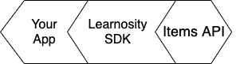
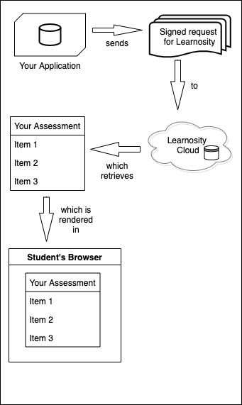

<p align="center"></p>
<h1 align="center">Learnosity SDK - Node.js</h1>
<p align="center">Everything you need to start building your app in Learnosity, with Node.js and the JavaScript programming language.<br> 
(Prefer another language? <a href="https://help.learnosity.com/hc/en-us/sections/360000194318-Server-side-development-SDKs">Click here</a>)<br>
An official Learnosity open-source project.</p>

[](https://github.com/Learnosity/learnosity-sdk-nodejs/releases)
[](https://travis-ci.com/Learnosity/learnosity-sdk-nodejs)
[](LICENSE.md)
[](https://github.com/Learnosity/learnosity-sdk-nodejs/releases)
---

## Table of Contents

* [Overview: what does it do?](#overview-what-does-it-do)
* [Requirements](#requirements)
* [Installation](#installation)
* [Quick start guide](#quick-start-guide)
* [Next steps: additional documentation](#next-steps-additional-documentation)
* [Contributing to this project](#contributing-to-this-project)
* [License](#license)
* [Usage tracking](#usage-tracking)
* [Further reading](#further-reading)

## Overview: what does it do?
The Learnosity Node.js SDK makes it simple to interact with Learnosity APIs.



It provides a number of convenience features for developers, that make it simple to do the following essential tasks:
* Creating signed security requests for API initialization, and
* Interacting with the Data API.

For example, the SDK helps with creating a signed request for Learnosity:


Once the SDK has created the signed request for you, your app sends that on to an API in the Learnosity cloud, which then retrieves the assessment you are asking for, as seen in the diagram below:



This scenario is what you can see running in the Quick start guide example ([see below](#quick-start-guide)).

There's more features, besides. See the detailed list of SDK features on the [reference page](REFERENCE.md).

[(Back to top)](#table-of-contents)

## Requirements
1. Runtime libraries for Node.js installed. ([instructions](https://nodejs.org/en/download/))

2. To follow the tutorial on this page, also install some other libraries: 
* [Express.js](http://expressjs.com/), a minimal web framework, 
* The [EJS](https://ejs.co/) templating language, and 
* The [UUID](https://www.npmjs.com/package/uuid) library. These are not actually a requirement of the SDK itself, so if your app doesn't use these libraries, no need to install them. They are only required for the tutorial on this page.

Not using Node.js? See the [SDKs for other languages](https://help.learnosity.com/hc/en-us/sections/360000194318-Server-side-development-SDKs).

### Supported Node.js Versions
The Learnosity SDK - Node.js is verified against [Active LTS and Maintenance LTS releases of Node.js](https://nodejs.org/en/about/releases/).

[(Back to top)](#table-of-contents)

## Installation
###  **Installation via NPM**
Using NPM is the recommended way to install the Learnosity SDK for Node.js in production. The easiest way is to run this from your parent project folder:

	npm install --save-dev https://github.com/Learnosity/learnosity-sdk-nodejs

To follow the tutorial on this page, also install some other libraries: 
* [Express.js](http://expressjs.com/), a minimal web framework, 
* The [EJS](https://ejs.co/) templating language, and 
* The [UUID](https://www.npmjs.com/package/uuid) library.
Install these by running the following commands.

    npm install express
    npm install ejs
    npm install uuid

*Note*: these additional libraries are not required by the Learnosity SDK. They are only required for the tutorial on this page.

### **Alternative method 1: download the zip file**
Download the latest version of the SDK as a self-contained ZIP file from the [GitHub Releases](https://github.com/Learnosity/learnosity-sdk-nodejs/releases) page. The distribution ZIP file contains all the necessary dependencies. 

Then, to follow the tutorial on this page, also install other libraries: [Underscore.js](https://underscorejs.org/) and [Moment.js](https://momentjs.com/). Install these by running the following commands.

    npm install express
    npm install ejs
    npm install uuid

*Note*: these additional libraries are not required by the Learnosity SDK. They are only required for the tutorial on this page.

### **Alternative method 2: development install from a git clone**
To install from the terminal, run this command:

    git clone git@github.com:Learnosity/learnosity-sdk-nodejs.git

Then, to follow the tutorial on this page, also install other libraries: [Underscore.js](https://underscorejs.org/) and [Moment.js](https://momentjs.com/). Install these by running the following commands.

    npm install express
    npm install ejs
    npm install uuid

*Note*: these additional libraries are not required by the Learnosity SDK. They are only required for the tutorial on this page.

Note that these manual installation methods are for development and testing only.
For production use, you should install the SDK using the NPM package manager for Node.js, as described above.

[(Back to top)](#table-of-contents)

## Quick start guide
Let's take a look at a simple example of the SDK in action. In this example, we'll load an assessment into the browser.

### **Start up your web server and view the standalone assessment example**
To start up your Node.js web server, first find the following folder location under the SDK. Change directory ('cd') to this location on the command line.

    .../learnosity-sdk-nodejs/docs/quickstart/assessment/

To start, run this command from that folder:

```
npm run start-standalone-assessment

```

From this point on, we'll assume that your web server is available at this local address (it will report the port being used when you launch it, by default it is port 3000): 

http://localhost:3000/

When you open this URL with your browser, the page will load. This is a basic example of an assessment loaded into a web page with Learnosity's assessment player. You can interact with this demo assessment to try out the various Question types.


[(Back to top)](#table-of-contents)

### **How it works**
Let's walk through the code for this standalone assessment example. The source file is included under the quickstart folder, in this location:

    .../learnosity-sdk-nodejs/docs/quickstart/assessment/standalone-assessment.js

The first section of code is JavaScript and is executed server-side. It constructs a set of configuration options for Items API, and securely signs them using the consumer key. The second section is HTML and JavaScript and is executed client-side, once the page is loaded in the browser. It renders and runs the assessment functionality.

[(Back to top)](#table-of-contents)

### **Server-side code**
We start by including the LearnositySDK helper this make it easy to generate and sign the config options.

``` javascript
const Learnosity = require('../../../index'); // Include Learnosity SDK helper
```

We also load some Learnosity variables from [config.js], specifically our consumer key and secret. 

``` javascript
const config = require('../config'); // Load consumer key & secret
```

We also specify a few libraries to run a minimal web server, "Express.js" for the purposes of this example.

``` javascript
const express = require('express'); // Load 'Express.js", a web server 
var app = express();              // Instantiate the web server
```

We also choose EJS as the view engine, and bring in the UUID library.

``` javascript
app.set('view engine', 'ejs'); // Set EJS as our templating language
const uuid = require('uuid');  // Bring in the UUID library
```

Now we set up the user_id, session_id (both UUID values), and domain configuration.

``` javascript
user_id = uuid.v4();    // Generate a UUID for the user ID
session_id = uuid.v4(); // Generate a UUID for the session ID
domain = 'localhost';   // Set the domain
```

Now we'll declare the configuration options for Items API. These specify which assessment content should be rendered, how it should be displayed, which user is taking this assessment and how their responses should be stored. 

``` javascript
app.get('/', function (req, res) { 
    const learnositySdk = new Learnosity(); // Instantiate the SDK
    const request = learnositySdk.init(  // Set Learnosity init options
        'items',                              // Select Items API
        {
            consumer_key: config.consumerKey, //Load key from config.js
            domain: 'localhost',              //Set the domain
        },
        config.consumerSecret,                //Load secret from config.js
        {
            type: 'local_practice',
            state: 'initial',
            activity_id: 'demo_3',
            rendering_type: 'assess',
            session_id: uuid.v4(),
            items: ['Demo3', 'Demo4'],
            user_id: 'test_user',
            config: {
                regions: 'main'
            }
        }
    );
```

TO DO:  feed in all the parameters below. 

NEW /\
OLD \/

items_request = items_request = {
    "user_id": user_id,
    "session_id": session_id,
    "activity_template_id": "quickstart_examples_activity_template_001",
    "activity_id": "quickstart_examples_activity_001",
    "rendering_type": "assess",
    "type": "submit_practice",
    "name": "Items API Quickstart",
    "state": "initial"
}
```

* `user_id`: unique student identifier. Note: we never send or save student's names or other personally identifiable information in these requests. The unique identifier should be used to look up the entry in a database of students accessible within your system only. [Learn more](https://help.learnosity.com/hc/en-us/articles/360002309578-Student-Privacy-and-Personally-Identifiable-Information-PII-).
* `session_id`: uniquely identifies this specific assessment attempt for save/resume, data retrieval and reporting purposes. Here, we're using the `Uuid` helper to auto-generate a unique session id.
* `activity_template_id`: reference of the Activity to retrieve from the Item bank. The Activity defines which Items will be served in this assessment.
* `activity_id`: a string you define, used solely for analytics to allow you run reporting and compare results of users submitting the same assessment.
* `rendering_type`: selects a rendering mode, `assess` mode is a "standalone" mode (loading a complete assessment player for navigation, as opposed to `inline` for embedding without).
* `type`: selects the context for the student response storage. `submit_practice` mode means the student responses will be stored in the Learnosity cloud, allowing for grading and review.
* `name`: human-friendly display name to be shown in reporting, via Reports API and Data API.
* `state`: Optional. Can be set to `initial`, `resume` or `review`. `initial` is the default.

**Note**: you can submit the configuration options either as a Python array as shown above, or a JSON string.

Next, we declare the Learnosity consumer credentials we'll use to authorize this request. We also construct security settings that ensure the report is initialized on the intended domain. The value provided to the domain property must match the domain from which the file is actually served. The consumer key and consumer secret in this example are for Learnosity's public "demos" account. Once Learnosity provides your own consumer credentials, your Item bank and assessment data will be tied to your own consumer key and secret.


NEW /\
OLD \/


``` python
security = {
    'consumer_key': 'yis0TYCu7U9V4o7M',
    'domain': 'localhost',
}
consumerSecret = '74c5fd430cf1242a527f6223aebd42d30464be22'
```

<i>(of course, you should never normally put passwords into version control)</i>

Now we call LearnositySDK's `Init()` helper to construct our Items API configuration parameters, and sign them securely with the `security`, `request` and `consumerSecret` parameters. `init.generate()` returns us a JSON blob of signed configuration parameters.

``` python
init = Init(
    'items', security, consumerSecret,
    request=items_request
)
generatedRequest = init.generate()
```

[(Back to top)](#table-of-contents)


**Note:** This SDK version only supports signing pre-written requests and does not provide any interface for sending the actual HTTP requests.

## Examples
You can find a complete site with examples of Learnosity integration in our [demo site](http://demos.learnosity.com/).

You can download the entire site or browse the code directly on [GitHub](https://github.com/Learnosity/learnosity-demos/).


## Usage

### Learnosity.init()


The init function is used to create the necessary *security* and *request* details used to integrate with a Learnosity API. Most often this will be a JavaScript object.

The init function takes up to 5 arguments:

 * [string]  service type
 * [array]   security details (**no secret**)
 * [string]  secret
 * [request] request details *(optional)*
 * [string]  action *(optional)*

```
Structure of Node.js project (based on Express.js and EJS template):
- node_modules
----- ejs
----- express
----- learnosity-sdk-nodejs
----- (all standard modules)
- views
----- index.ejs
- package.json
- package-lock.json
- app.js
```

``` javascript
app.js:

var Learnosity = require('learnosity-sdk-nodejs');
var express = require('express');
var app = express();

app.set('view engine', 'ejs');

app.get('/', function (req, res) {
    var learnositySdk = new Learnosity();
    var request = learnositySdk.init(
        // service type
        "questions",

        // security details
        {
            "consumer_key": "yis0TYCu7U9V4o7M",
            "domain":       "localhost",
            "user_id":      "$ANONYMIZED_USER_ID"
        },

        // secret
        "74c5fd430cf1242a527f6223aebd42d30464be22",

        // request details
        {
            "type":       "local_practice",
            "state":      "initial",
            "questions":  [
                {
                    "response_id":         "60005",
                    "type":                "association",
                    "stimulus":            "Match the cities to the parent nation.",
                    "stimulus_list":       ["London", "Dublin", "Paris", "Sydney"],
                    "possible_responses":  ["Australia", "France", "Ireland", "England"],
                    "validation": {
                    "score": 1,
                        "value": ["England", "Ireland", "France", "Australia"]
                    }
                }
            ]
        }
    );

    res.render("index", { request: request } );
});

app.listen(3000, function () {
    console.log('Example app listening on port 3000!');
});
```

``` html
index.ejs:

// Pass the object to the initialisation of any Learnosity API, in this example the Questions API
<!DOCTYPE html>
<html>
<head lang="en">
    <meta charset="UTF-8">
    <title>Learnosity SDK - NodeJS</title>
</head>
<body>
<span class="learnosity-response question-60005"></span>
<script src="//questions.learnosity.com/?v2"></script>
<script>
	var request = <%- JSON.stringify(request) %>
	console.log(request);
    var questionsApp = LearnosityApp.init(request);
</script>
</body>
</html>
```

``` json
package.json:

{
  "name": "nodeapp",
  "version": "1.0.0",
  "description": "Test NodeJS sdk",
  "main": "app.js",
  "scripts": {
    "test": "echo \"Error: no test specified\" && exit 1"
  },
  "author": "",
  "license": "ISC",
  "dependencies": {
    "ejs": "^2.5.7",
    "express": "^4.16.2",
    "learnosity-sdk-nodejs": "git+https://github.com/Learnosity/learnosity-sdk-nodejs.git#v0.5.0"
  }
}
```

```
run node.js application: node app.js
check browser: http://localhost:3000/
```

#### Init() Arguments
**service**<br>
A string representing the Learnosity service (API) you want to integrate with. Valid options are:

* assess
* author
* data
* events
* items
* questions
* reports

**security**<br>
An array^ that includes your *consumer_key* but does not include your *secret*. The SDK sets defaults for you, but valid options are:

* consumer_key (mandatory)
* domain (mandatory)
* timestamp (optional - the SDK will generate this for you)
* user_id (optional - not necessary for all APIs)

^Note – the SDK accepts a JSON string and native JavaScript objects.

**secret**<br>
Your private key, as provided by Learnosity.

**request**<br>
An optional associative array^ of data relevant to the API being used. This will be any data minus the security details that you would normally use to initialise an API.

^Note – the SDK accepts a JSON string and normal JavaScript objects.

**action**<br>
An optional string used only if integrating with the Data API. Valid options are:

* get
* set
* update
* delete

## Tracking
In version v0.5.0 we introduced code to track the following information by adding it to the request being signed:
- SDK version
- SDK language
- SDK language version
- Host platform (OS)
- Platform version

We use this data to enable better support and feature planning. All subsequent versions of the SDK shall include this usage tracking.
